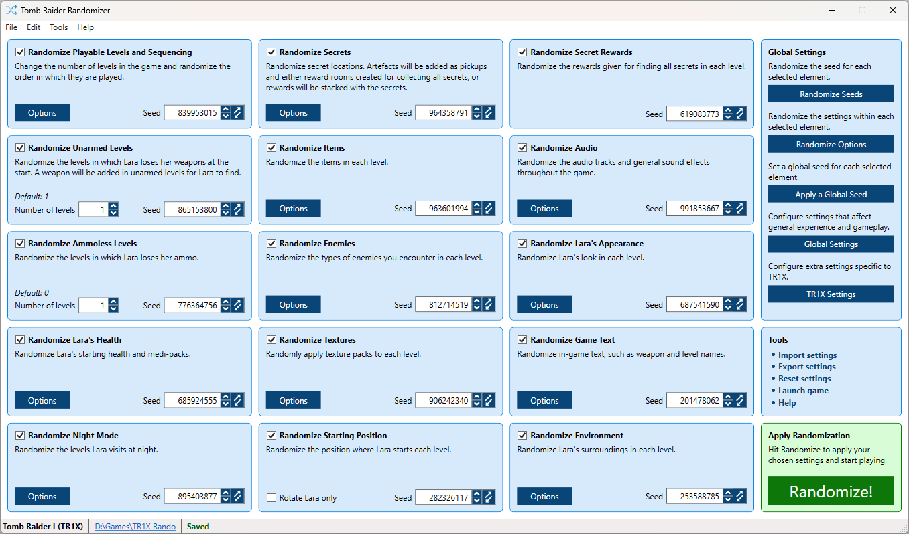

# TR-Rando
Tomb Raider Game Randomizer

# Installation
Please follow the steps provided in this video:

https://user-images.githubusercontent.com/9203254/148436641-6dd771ad-7b41-422e-a938-1fb70a3d279c.mp4

Download latest release here: https://github.com/DanzaG/TR2-Rando/releases/latest

View [detailed user guide](USING.md).

# Features

* **Secrets** - Randomizes locations of secrets and their rewards.
* **Items** - Randomizes pickups, including key items!
* **Enemies** - Randomizes the types of enemies you encounter.
* **Textures** - Randomly applies textures to levels.
* **Level Sequencing** - Change the number of levels in the game and randomize their order.
* **Inventory Loss** - Randomizes what levels Lara loses her guns and/or ammo and items.
* **Audio** - Randomizes title screen, level ambience, trigger soundtracks, secret soundtracks and sound effects.
* **Sunsets** - Randomizes what levels have the Bartoli's Hideout sunset effect.
* **Outfits** - Randomizes the outfit Lara wears in each level, including options like invisibility and haircuts.
* **Text** - Randomizes in-game text, such as weapon and level names. Includes a variety of languages to choose from.
* **Night Mode/VFX** - Darken levels to give a night-time effect or apply visual effects to TR3.
* **Starting Position** - Choose to have Lara start levels in different positions facing a different direction.
* **Environment** - Modifies the level environment, such as mixing up water levels, mirroring levels, moving keyholes, randomizing traps and adding new puzzle/challenge areas.
* And more!

# Getting Started
1. Download the latest version at https://github.com/DanzaG/TR2-Rando/releases. Make sure to download the zip and not the source code.
2. Extract.
3. Run "TRRandomizer.exe" and follow the instructions.
4. Play and enjoy!

View [detailed user guide](USING.md).

# Discord
We have a friendly community Discord server [here](https://discord.gg/f4bUqwgcCN).

# Tracker
For keeping track of levels while you play, check out the [TRRandoTracker](https://github.com/lahm86/TRRandoTracker).

# Screenies

[View all](Resources/Screenshots).

# Development
You will need the following dependencies:

### NuGet Packages
* https://github.com/icsharpcode/SharpZipLib - Used for Zlib functions.
* https://github.com/JamesNK/Newtonsoft.Json - Serialization/de-serialization of data.

### Additional Build Dependencies
* https://github.com/lahm86/TRGameflowEditor/releases/latest - TRGameflowEditor by Lahm.
* https://github.com/lahm86/RectanglePacker/releases/latest - RectanglePacker by Lahm.

# Thanks
* Everyone - For playing and reporting bugs/areas for improvement. Rando wouldn't be where it is today without exceptional support from players.
* Eycore - Lots of ideas and locations, huge help for zoning key items.
* Lahm86 - For his massive contributions to improving the randomizer - massive thanks. Please check out his project for randomizing the script files here: https://github.com/lahm86/TRGameflowEditor TRGE is the base for all script randomization features in this program.
* Aquila_chrysaetos - For their contributions to helping key item zoning.
* Nenad_ - Lots of ideas and locations
* chreden - For TRView, which has been invaluable during development and picking locations as well as helping me debug and understand the TR5 file format. Please visit the project at: https://github.com/chreden/trview
* b122251 - For TRMod, which was used initially to modify the levels prior to the native implementation, fantastic command-line tool you can grab here: https://core-design.com/community_trmod.html
* JW-dev/Bahamete - For initial work on script randomization
* Anopob - For various contributions and bug fixes!
* apel - Lots of ideas and development help.
* Trxye - Lots of ideas and development help.
* Towandaa - Lots of ideas and contributions, including secret, vehicle and sprite randomization.
* Leoc1995 - For TR1 puzzle inspiration and contributing enemy variants from his [TRLEs](https://trcustoms.org/users/854).
* Dash and Walkawayy - For providing great support and rando-related additions to [Tomb1Main](https://github.com/rr-/Tomb1Main).
* Jimmy Beon - Providing us with an excellent assortment of custom textures for use in rando.
* Topixtor - For endless testing to fix issues such as the opera house/barkhang entity freeze and mirrored levels, and providing enemy variations from his [TRLEs](https://trcustoms.org/users/927).
* Radgryd - For endless TR1 testing and lots of great ideas for the rando.
* Ralodosmovo - For providing an assortment of custom textures, and lots of ideas for the rando.
* Lilly Jericho - For endless testing to fix issues such as the opera house/barkhang entity freeze, mirrored levels, and providing great continuous feedback. Lilly was also a coordinator of the huge translation effort by the community, with a special thanks to the following translators:
    * Croatian - Erackk
    * Czech - Sabatu
    * Dutch - BeardedBogle, Dokus, & LordMeShine
    * Finnish - Riku
    * French - Hedteur & LeonHeart
    * German - Lilly Jericho & Radgryd
    * Italian - Diego & Nanaki
    * Japanese - ChiburuTV
    * Polish - DJ_Full & NaBu
    * Portuguese - Fuse & Jumica
    * Russian - Fetch
    * Swedish - Pikkufighter & Woof Smit

