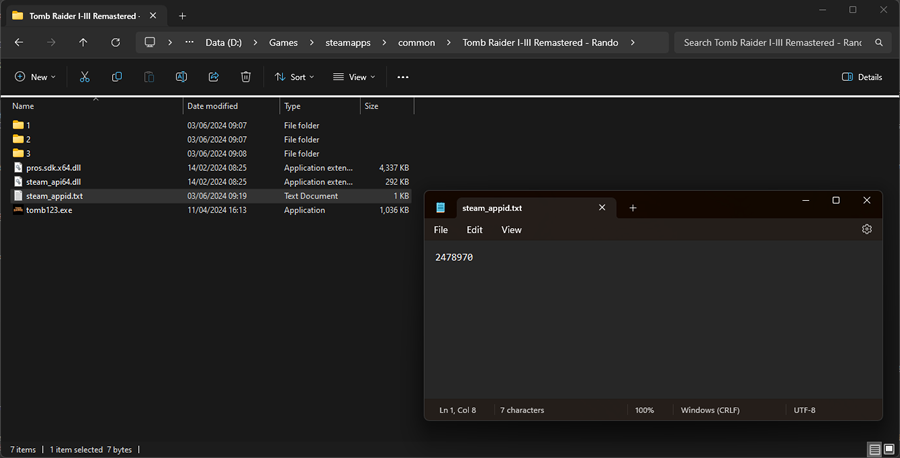
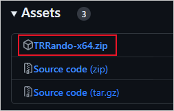
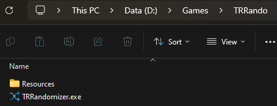
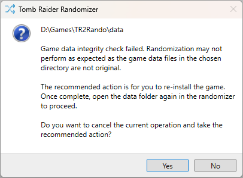
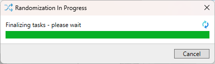
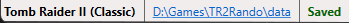

# Randomizer Setup

On this page:
- [Prerequisites](#prerequisites)
  - [TR1](#tr1)
  - [TR2](#tr2)
  - [TR3](#tr3)
  - [TR I-III Remastered](#tr-i-iii-remastered)
- [Installing the Randomizer](#installing-the-randomizer)
- [Game Selection](#game-selection)
- [Randomizing](#randomizing)
- [Playing](#playing)
- [Re-randomizing](#re-randomizing)
- [Old Save Files](#old-save-files)
- [Reverting](#reverting)
- [Troubleshooting](#troubleshooting)
  - [.NET Core](#net-core)
  - [General Issues](#general-issues)
  - [FAQs](#faqs)

To play the randomizer, you will need to have the relevant TR1, TR2 or TR3 game(s) installed on your PC. It is important that the data files for these games are "clean", meaning that they should not have been modified by any other custom tool. If you are in any doubt about this, the first step you should take is to reinstall the game (for example in Steam or GoG). Please note that the rando team cannot offer overly specific advice on game reinstallation as every system is different; you should refer to instructions specific to your system (e.g. Steam/GoG) as required, and should have a reasonable understanding of how your own PC is configured.

Following is a brief video explanation of the setup, but be sure to read each of the following points as well.

## Prerequisites

Before you launch the randomizer for the first time, you should carry out a few steps as follows.
***
> ### TR1
> You must use [TR1X](https://github.com/LostArtefacts/TR1X) to be able to randomize Tomb Raider 1. Follow the installation guide on the TR1X GitHub page, or you can also refer to [this video](https://www.youtube.com/watch?v=WfyHin4Hpgs) for guidance. Note that if using the TR1X installer, the default directory where your game will be located is your Documents folder as opposed to the base game folder.
> 
> You must also ensure that you have the Unfinished Business levels files in your installation. These are available when using the TR1X installer, and we recommend that you choose the set that contains music triggers. The level files are also available to download manually from https://lostartefacts.dev/aux/tr1x/trub-music.zip - you can then simply extract the files into your TR1X data folder.
***
> ### TR2
> Use the [Version Swapper](https://github.com/TombRunners/tr2-version-swapper) or install and configure [TR2Main](https://github.com/Arsunt/TR2Main).
>
> _This step is entirely optional based  on your own preference of gameplay._
***
> ### TR3
> Use the [Version Swapper](https://github.com/TombRunners/tr3-version-swapper) or install and configure [tomb3](https://github.com/Trxyebeep/tomb3). Using tomb3 is recommended to enable all features in the randomizer, plus to enjoy all of the benefits of the improved game. See https://github.com/Trxyebeep/tomb3/blob/master/USING.md for detailed installation steps.
>
> _This step is entirely optional based on your own preference of gameplay._
***

It is recommended at this point that you create a copy of your game folder. If you choose to use the original folder and decide later that you want to revert the changes made by the randomizer, see the [relevant point below](USING.md#reverting).

Let's say you are setting up TR2 and have it installed in `D:\Games\TR2`. You should copy this folder in its entirety and name it something like `D:\Games\TR2Rando`.

### TR I-III Remastered
For TR I-III Remastered, you *may* need to carry out an additional step if using Steam to prevent Steam from always launching the original exe. After creating a copy of your Remastered folder, look for a text file with the name `steam_appid.txt` - if it doesn't exist, create it. Inside this text file, add the app ID, which is `2478970`.

Note too that some files are shared so if you randomize TR1R, you may for example see some text changes in both TR2R and TR3R as a result. Use the [reverting](USING.md#reverting) guide below to restore each games' shared text to default if you wish.

> ### IMPORTANT
> Now that you have a dedicated folder for the randomizer to work on, you should **_not_** change anything manually in this folder as it can cause corruption when randomizing again. Everything can be controlled in the randomizer, so provided that you have set the game up as above per your preferences, you should have no need to edit anything manually.

## Installing the Randomizer
Setting up the randomizer itself is straight-forward.
1. Download the latest release from https://github.com/LostArtefacts/TR-Rando/releases/latest. Make sure to download the `TRRando` zip file and not the source code. Choose the x64 or x86 version, depending on your system.

    
    
2. Extract the downloaded zip file (it does not matter where you extract the zip file to). The resultant folder should appear as follows.

    
    
3. Launch `TRRandomizer.exe` to begin.

## Game Selection
Click on `Browse` in the initial window and select the **DATA** folder in the TR game folder you wish to randomize. This continues the example above, so we pick `D:\Games\TR2Rando\data`.

The randomizer will now check the data in the folder you have selected and create a backup of the files, which it will use as a base for randomization. If the data in the folder you have selected does not match the original game files, you will see the following message.

It is **_strongly_** recommended that you click `Yes` if you see this message, reinstall the game and follow this guide carefully again from the [beginning](USING.md#randomizer-setup).

## Randomizing
Now that you have your TR game folder open in the randomizer, you can select each aspect that you wish to randomize. There are several options available, so be sure to click the available `Options` button in each pane. Note that for TR I-III Remastered, the options that are available to randomize are much more limited than the classics. Only the following aspects are currently supported, the remaining options will be greyed out in the UI.

- Secrets
- Items
- Enemies
- Textures
- Start positions
- Secret rewards (excluding TR2R)
- Audio
- Game text

When you are ready to start, click the large green `Randomize` button. A progress bar will appear and the randomizer will make the selected changes.

Note that the first time you run the randomizer against a _remastered_ game, you will see the following message in the progress window. This stage will take a few moments to process, but depending on your system specification it could take quite a number of seconds. Bear with it. This runs only once for TR1R, once for TR2R and once again for TR3R - the next time you randomize any of these games, the stage is skipped.

Once complete, the progress dialog will close and the randomizer will show `Saved` in the bottom status bar.

## Playing
Now that your game has been randomized, you can launch and play! Open the game in the usual way. It should be obvious that the process has worked successfully once you begin playing a level, but as a guide you should see the following wording change in the title screen (this applies to all TR versions).

You can start and stop the game as you please - you do not need to re-randomize each time. So you could play a few levels, save and exit the game and then return to the same save the next day, for example.

## Re-randomizing
Once you have completed a run of the game, you may wish to jump straight into another using different settings. All you need to do is re-launch the randomizer and this time select the same folder shown in the `Recent Folders` list.

The settings you previously selected will be shown, so simply change as much or as little as you like and click `Randomize` again.

### Old Save Files
In the majority of cases, save files that were created in previous runs will not work if you have since changed settings in the randomizer; the game will either crash or you will experience some very strange results. You can safely delete your save files prior to starting the game after running the randomizer, or otherwise take care to only load saves created in your current run.

Note that for TR I-III Remastered, separating out saves is much more difficult as all games share a single file. You can backup this file manually if you wish to be safe - it is located in, for example, `C:\Users\YOU\AppData\Roaming\TRX\STEAMID\savegame.dat`.

## Reverting
If you wish to restore your game folder to its original state, click on the `Tools` menu and select `Restore To Default`.

## Troubleshooting

### .NET Core
You may see the following error message when you try to launch the randomizer - this means that your system is missing the .NET Core Runtime, which the randomizer needs in order to run. Simply follow the prompt to install the runtime, and then launch the randomizer again.

If however the randomizer doesn't launch, but you don't see the above error, you can install the runtime manually. Use one of the following links depending on your system.

- x64: https://aka.ms/dotnet/6.0/windowsdesktop-runtime-win-x64.exe
- x86: https://aka.ms/dotnet/6.0/windowsdesktop-runtime-win-x86.exe

### General issues
If you encounter error messages during randomization, the most likely cause is unclean data files. In this case, you should follow these steps.

1. Click on the `Tools` menu and select `Delete Backup`.

    

2. Click Yes at the prompt.

    

3. Uninstall the TR game from your system (e.g. in Steam or GoG). You should also manually uninstall any third-party modifications you may have applied as these may not be captured by the uninstall process.
4. Reinstall the TR game from scratch (e.g. in Steam of GoG).
5. Follow this guide carefully from the [beginning](USING.md#randomizer-setup).

If you continue to experience issues, we have a friendly community [Discord server](https://discord.gg/f4bUqwgcCN) where you can get help or you can [raise an issue](https://github.com/LostArtefacts/TR-Rando/issues/new) for investigation.

## FAQs
- _Where is my original game folder?_
  
  This can vary depending on which system you used to install the game.
  - For Steam, you can right-click on the game in your library and select `Manage` | `Browse Local Files`. This will open the folder where the game files are located in Explorer and you can then copy the address as necessary.
  - For GoG, you can find the general installation folder under `Settings` | `Installing, updating` | `Game installation folder`. Browse to this folder in Explorer and then locate your game folder there.

- _I have installed TR1X but when I open the folder in the randomizer, it can't find the data files. What should I do?_

  When you install TR1X using its installer and, for example, target your Steam copy of the game, TR1X will be installed by default into your Documents folder as opposed to the original Steam folder. You can change this folder when running the installer. So all you need to do is point the randomizer to this folder instead of your Steam/GOG/original folder.

- _I have installed TR2Main/tomb3 but when I open the folder in the randomizer, it can't find the data files. What should I do?_

  TR2Main and tomb3 do not have installers like TR1X, and do not ship with the data files as these need to come from your original game folder. The best way to setup TR2Main/tomb3 is to manually copy your original TR2/TR3 folder, then extract the TR2Main/tomb3 files into that folder, and overwrite when prompted. Then simply point the randomizer to this copied folder.

- _I am stuck trying to find a key item. How can I locate it?_

  If you need help trying to locate a key item for progression, download [trview](https://github.com/chreden/trview/releases/latest). Once downloaded, open the level file you are currently playing e.g. `D:\Games\TR2Rando\data\WALL.TR2`. You can then click `Windows` | `Items` and find the item you are missing. In TR1, level files have the extension `.PHD`; in TR2 and TR3, the extension is `.TR2`.
  
- _I am stuck trying to obtain/reach a secret. Where can I get help?_

  Some difficult secrets have been documented on the [TRRando YouTube channel](https://www.youtube.com/@trrandomizer) so you can check if your secret is there for some guidance. If you still need help, post a question in the relevant `secret-help` channel in [Discord](https://discord.gg/f4bUqwgcCN).
