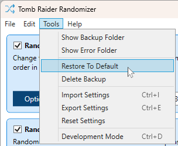

# Randomizer Setup

To play the randomizer, you will need to have the relevant TR1, TR2 or TR3 game(s) installed on your PC. It is important that the data files for these games are "clean", meaning that they should not have been modified by any other custom tool. If you are in any doubt about this, the first step you should take is reinstalling the game (for example in Steam or GoG).

## Prerequisites

Before you launch the randomizer for the first time, you should carry out a few steps as follows.
***
> ### TR1
> It is **strongly** recommended that you use [Tomb1Main](https://github.com/rr-/Tomb1Main). Follow the installation guide on the Tomb1Main GitHub page, or you can also refer to [this video](https://www.youtube.com/watch?v=WfyHin4Hpgs&t=46s) for guidance.
> 
> The use of [TombATI](https://github.com/Carlmundo/TombRaider-AutomatedFix) is also supported but this is limited in terms of the options available and is not as customizable as Tomb1Main.
***
> ### TR2
> Use the [Version Swapper](https://github.com/TombRunners/tr2-version-swapper) or install and configure [TR2Main](https://github.com/Arsunt/TR2Main).
>
> _This step is entirely optional based  on your own preference of gameplay._
***
> ### TR3
> Use the [Version Swapper](https://github.com/TombRunners/tr3-version-swapper) or install and configure [tomb3](https://github.com/Trxyebeep/tomb3).
>
> _This step is entirely optional based on your own preference of gameplay._
***
It is recommended at this point that you create a copy of your game folder. If you choose to use the original folder and decide later that you want to revert the changes made by the randomizer, see the [relevant point below](USING.md#reverting).

Let's say you are setting up TR2 and have it installed in `D:\Games\TR2`. You should copy this folder in its entirety and name it something like `D:\Games\TR2Rando`.

> ### IMPORTANT
> Now that you have a dedicated folder for the randomizer to work on, you should **_not_** change anything manually in this folder as it can cause corruption when randomizing again. Everything can be controlled in the randomizer, so provided that you have set the game up as above per your preferences, you should have no need to edit anything manually.

## Installing the Randomizer
Setting up the randomizer itself is straight-forward.
1. Download the latest release from https://github.com/DanzaG/TR2-Rando/releases. Make sure to download the zip file with the current version name and not the source code.

    
    
2. Extract the downloaded zip file (it does not matter where you extract the zip file to). The resultant folder should appear as follows.

    
    
3. Launch `TRRandomizer.exe` to begin.

## Game Selection
Click on `Browse` in the initial window and select the **DATA** folder in the TR game folder you wish to randomize. This continues the example above, so we pick `D:\Games\TR2\data`.

The randomizer will now check the data in the folder you have selected and create a backup of the files, which it will use as a base for randomization. If the data in the folder you have selected does not match the original game files, you will see the following message.

It is **_strongly_** recommended that you click `Yes` if you see this message, reinstall the game and follow this guide carefully again from the [beginning](USING.md#randomizer-setup).

## Randomizing
Now that you have your TR game folder open in the randomizer, you can select each aspect that you wish to randomize. There are several options available, so be sure to click the available `Options` button in each pane.

When you are ready to start, click the large green `Randomize` button. A progress bar will appear and the randomizer will make the selected changes.

Once complete, the progress dialog will close and the randomizer will show `Saved` in the bottom status bar.

## Playing
Now that your game has been randomized, you can launch and play! Open the game in the usual way. It should be obvious that the process has worked successfully once you begin playing a level, but as a guide you should see the following wording change in the title screen (this applies to all TR versions).

You can start and stop the game as you please - you do not need to re-randomize each time. So you could play a few levels, save and exit the game and then return to the same save the next day, for example.

## Re-randomizing
Once you have completed a run of the game, you may wish to jump straight into another using different settings. All you need to do is re-launch the randomizer and this time select the same folder shown in the `Recent Folders` list.

The settings you previously selected will be shown, so simply change as much or as little as you like and click `Randomize` again.

### Old Save Files
In the majority of cases, save files that were created in previous runs will not work if you have since changed settings in the randomizer; the game will either crash or you will experience some very strange results. You can safely delete your save files prior to starting the game after running the randomizer, or otherwise take care to only load saves created in your current run.

## Reverting
If you wish to restore your game folder to its original state, click on the `Tools` menu and select `Restore To Default`.

## Troubleshooting
If you encounter error messages during randomization, the most likely cause is unclean data files. In this case, you should follow these steps.

1. Click on the `Tools` menu and select `Delete Backup`.

    

2. Click Yes at the prompt.

    

3. Reinstall the TR game from scratch (e.g. in Steam or GoG).
4. Follow this guide carefully from the [beginning](USING.md#randomizer-setup).

If you continue to experience issues, we have a friendly community [Discord server](https://discord.gg/f4bUqwgcCN) where you can get help or you can [raise an issue](https://github.com/DanzaG/TR2-Rando/issues/new) for investigation.
